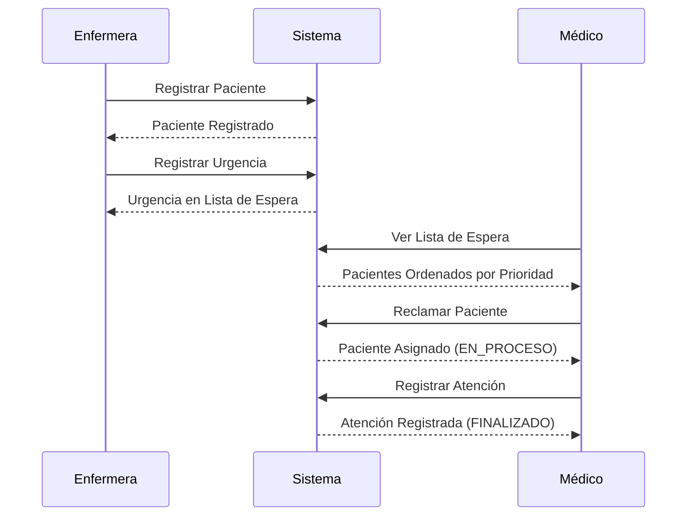

# Hospital Urgencias - API REST

API REST para el sistema de gestión de urgencias hospitalarias desarrollado con ASP.NET Core 8.0.

## 🚀 Inicio Rápido

### Prerrequisitos

- .NET 8.0 SDK
- Un IDE o editor (Visual Studio, VS Code, Rider)

### Ejecutar la aplicación

```bash
cd Webb
dotnet run
```

La API estará disponible en:
- **HTTP**: http://localhost:5000
- **HTTPS**: https://localhost:5001
- **Documentación (Scalar)**: http://localhost:5000/scalar

## 📚 Documentación

Para información detallada sobre los endpoints de la API, consulta [API_DOCUMENTATION.md](./API_DOCUMENTATION.md)

## 🏗️ Arquitectura

El proyecto sigue una arquitectura en capas:

```
Webb (Presentación - API REST)
  ↓
Aplicacion (Lógica de Negocio)
  ↓
Dominio (Entidades y Reglas de Negocio)
  ↓
Infraestructura (Repositorios y Persistencia)
```

### Estructura del Proyecto Webb

```
Webb/
├── Controllers/          # API Controllers
│   ├── AuthController.cs
│   ├── PacientesController.cs
│   ├── UrgenciasController.cs
│   └── AtencionesController.cs
├── DTOs/                # Data Transfer Objects
│   ├── Auth/
│   ├── Pacientes/
│   ├── Urgencias/
│   ├── Atenciones/
│   └── Common/
├── Components/          # Blazor Components (opcional)
├── Program.cs           # Configuración y startup
└── appsettings.json     # Configuración de la aplicación
```

## 🔧 Configuración

### Inyección de Dependencias

Los servicios están configurados en `Program.cs`:

- **Singleton**: Repositorios (mantienen estado en memoria)
- **Scoped**: Servicios de aplicación (nueva instancia por request)

### CORS

CORS está habilitado para permitir requests desde cualquier origen en desarrollo. **Ajustar en producción**.

### Documentación con Scalar

La API utiliza **Scalar** para proporcionar documentación interactiva moderna. Scalar genera automáticamente documentación a partir de la especificación OpenAPI y ofrece:

- Interfaz moderna y responsive
- Ejemplos de código en múltiples lenguajes
- Testing interactivo de endpoints
- Búsqueda avanzada
- Dark mode automático

## 🧪 Testing

Ejecutar todos los tests:

```bash
cd ..
dotnet test
```

El proyecto incluye 89 tests unitarios que cubren:
- Registro de pacientes
- Autenticación
- Reclamación de pacientes
- Registro de atenciones

## 📊 Módulos Implementados

### ✅ IS2025-001: Módulo de Urgencias
- Registro de urgencias por enfermeras
- Cola de espera con priorización automática

### ✅ IS2025-002: Registro de Pacientes
- Registro completo de pacientes
- Validación de CUIL
- Gestión de obras sociales

### ✅ IS2025-003: Reclamación de Pacientes
- Médicos reclaman pacientes de la lista de espera
- Cambio de estado automático

### ✅ IS2025-004: Registro de Atención
- Médicos registran informes de atención
- Finalización de ingresos

### ✅ IS2025-005: Autenticación
- Registro de usuarios (Médico/Enfermera)
- Login con contraseñas hasheadas (BCrypt)
- Validación de email y contraseña

## 🔐 Seguridad

- **Contraseñas**: Hasheadas con BCrypt (nunca almacenadas en texto plano)
- **CUIL**: Validación con dígito verificador
- **Email**: Validación de formato
- **Mensajes de error**: Genéricos para no revelar información sensible

## 🎯 Roles y Permisos

### Enfermera
- Registrar pacientes
- Registrar urgencias

### Médico
- Reclamar pacientes de la lista de espera
- Registrar atenciones médicas

## 📝 Notas de Implementación

1. **Persistencia**: Los datos se almacenan en memoria. En producción, implementar persistencia real (SQL Server, PostgreSQL, etc.)

2. **Autenticación**: Actualmente usa headers simples. En producción, implementar JWT tokens.

3. **Sesiones**: Cada repositorio es Singleton para mantener estado entre requests. En producción con persistencia real, usar Scoped.

4. **Validaciones**: Todas las validaciones están en la capa de aplicación y son verificadas por tests unitarios.

## 🔄 Flujo de Trabajo



## 🛠️ Comandos Útiles

### Desarrollo
```bash
# Ejecutar en modo watch (recarga automática)
dotnet watch run

# Ver logs detallados
dotnet run --verbosity detailed
```

### Build
```bash
# Build en modo release
dotnet build -c Release

# Publicar para producción
dotnet publish -c Release -o ./publish
```

## 📖 Recursos Adicionales

- [Documentación ASP.NET Core](https://docs.microsoft.com/es-es/aspnet/core)
- [Swagger/OpenAPI](https://swagger.io/)
- [BCrypt](https://github.com/BcryptNet/bcrypt.net)

## 👨‍💻 Desarrollo

Para agregar nuevos endpoints:

1. Crear DTOs en `DTOs/`
2. Crear Controller en `Controllers/`
3. Registrar servicios necesarios en `Program.cs`
4. Documentar en `API_DOCUMENTATION.md`

## 🐛 Troubleshooting

### Puerto ya en uso
```bash
# Cambiar puerto en launchSettings.json o usar:
dotnet run --urls "http://localhost:5555"
```

### Problemas con HTTPS en desarrollo
```bash
# Confiar en certificado de desarrollo
dotnet dev-certs https --trust
```

## 📞 Contacto

Para preguntas o issues, consulta la documentación del proyecto principal en `/README.md`